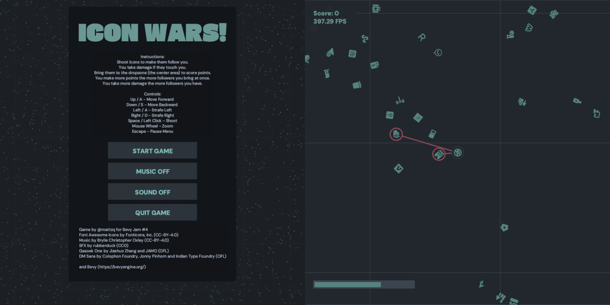

# Icon Wars

My entry for [Bevy Game Jam #4](https://itch.io/jam/bevy-jam-4)!

This is my first ever game jam so I kept it really simple. It's
mostly based around a simple boids simulation.

**Instructions**

* Shoot icons to make them follow you.
* You take damage if they touch you.
* Bring them to the dropzone (the center area) to score points.
* You make more points the more followers you bring at once.
* You take more damage the more followers you have.

**Controls**
    
* Up / W - Move Forward 
* Down / S - Move Backward 
* Left / A - Strafe Left
* Right / D - Strafe Right
* Space / Left Click - Shoot
* Mouse Wheel - Zoom
* Escape - Pause Menu

You can also press `O` to open up the development settings, most of them
can be adjusted in real-time, but it may crash the game.

## TODO

* [X] fix controls (up should always be up from the camera point of view)
* [ ] change sound effect spamming (n projectiles playing 1 effect instead of n)
* [ ] escape on web also closes fullscreen, add other key for pause screen
* [ ] make captured hud less obstructive (make smaller and add more transparency)
* [ ] add more animations to dropping off icons
* [ ] improve win condition to be more satisfying somehow (make the grid full of icons, ...)

## Changelog

* `v0.1.8` fix issue with wasm build of bevy_egui
* `v0.1.4` update bevy version and lock movement rotation
* `v0.1.3` (**this version was the Bevy Jam entry**) removed some verbose debug logging; fixed player allowed to shoot in dropzone
* `v0.1.2` fixed a bug where the game crashed when all music tracks were played
* `v0.1.1` initial release

## Copyright / Licenses

### Font Awesome Icons

License: [CC-BY-4.0](https://creativecommons.org/licenses/by/4.0/) + MIT

> Fonticons, Inc. (https://fontawesome.com)
> 
> --------------------------------------------------------------------------------
> 
> Font Awesome Free License
> 
> Font Awesome Free is free, open source, and GPL friendly. You can use it for
> commercial projects, open source projects, or really almost whatever you want.
> Full Font Awesome Free license: https://fontawesome.com/license/free.
> 
> --------------------------------------------------------------------------------
> 
> Icons: CC BY 4.0 License (https://creativecommons.org/licenses/by/4.0/)
> 
> The Font Awesome Free download is licensed under a Creative Commons
> Attribution 4.0 International License and applies to all icons packaged
> as SVG and JS file types.
> 

* [`@fortawesome/free-regular-svg-icons`](https://www.npmjs.com/package/@fortawesome/free-regular-svg-icons)
* [`@fortawesome/free-brands-svg-icons`](https://www.npmjs.com/package/@fortawesome/free-brands-svg-icons)

### Fonts

* [Gasoek One](https://fonts.google.com/specimen/Gasoek+One), SIL Open Font License. Designed by Jiashuo Zhang, JAMO

> Copyright 2022 The Gasoek Project Authors (https://github.com/JAMO-TYPEFACE/Gasoek)
> 
> This Font Software is licensed under the SIL Open Font License, Version 1.1.
> This license is copied below, and is also available with a FAQ at:
> http://scripts.sil.org/OFL

* [DM Sans](https://fonts.google.com/specimen/DM+Sans), SIL Open Font License. Designed by Colophon Foundry, Jonny Pinhorn, Indian Type Foundry.

> Copyright 2014 The DM Sans Project Authors (https://github.com/googlefonts/dm-fonts)
>                                                                                                   
> This Font Software is licensed under the SIL Open Font License, Version 1.1.
> This license is copied below, and is also available with a FAQ at:
> http://scripts.sil.org/OFL

### Background Music

* [From the Stillness of Winter](https://freemusicarchive.org/music/Brylie_Christopher_Oxley/liminal-space/from-the-stillness-of-winter/) by Brylie Christopher Oxley is licensed under a Attribution 4.0 International License.
* [Praise the Day](https://freemusicarchive.org/music/Brylie_Christopher_Oxley/liminal-space/praise-the-day/) by Brylie Christopher Oxley is licensed under a Attribution 4.0 International License.
* [Pack Dynamic](https://freemusicarchive.org/music/Brylie_Christopher_Oxley/liminal-space/pack-dynamic/) by Brylie Christopher Oxley is licensed under a Attribution 4.0 International License.
* [Silver Linings](https://freemusicarchive.org/music/Brylie_Christopher_Oxley/liminal-space/silver-linings/) by Brylie Christopher Oxley is licensed under a Attribution 4.0 International License.
* [Our Slow Recovery](https://freemusicarchive.org/music/Brylie_Christopher_Oxley/liminal-space/our-slow-recovery/) by Brylie Christopher Oxley is licensed under a Attribution 4.0 International License.

### Sound Effects

* [50 CC0 Sci-Fi SFX by rubberduck](https://opengameart.org/content/50-cc0-sci-fi-sfx), Public Domain

### Dependencies

* [`bevy`](https://crates.io/crates/bevy) (MIT OR Apache-2.0)
* [`egui`](https://crates.io/crates/egui) (MIT OR Apache-2.0)
* [`bevy_egui`](https://crates.io/crates/bevy_egui) (MIT)
* [`lyon`](https://github.com/nical/lyon) (MIT OR Apache-2.0)
* [`bevy_prototype_lyon`](https://crates.io/crates/bevy_prototype_lyon) (MIT OR Apache-2.0)
* [`anyhow`](https://crates.io/crates/anyhow) (MIT OR Apache-2.0)
* [`thiserror`](https://crates.io/crates/thiserror) (MIT OR Apache-2.0)
* [`serde`](https://crates.io/crates/serde) (MIT OR Apache-2.0)
* [`serde_json`](https://crates.io/crates/serde_json) (MIT OR Apache-2.0)
* [`rand`](https://crates.io/crates/rand) (MIT OR Apache-2.0)

### Other

* https://github.com/bevyengine/bevy_github_ci_template
* https://github.com/mattzque/bevy-officespace
* https://github.com/mattzque/bevy-boids-experiment